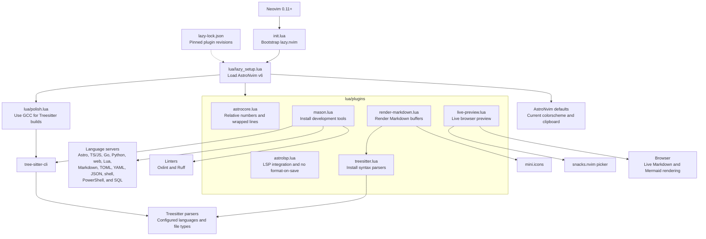

# Neovim configuration

Personal AstroNvim v6 configuration for Windows.

## Requirements

- Neovim 0.11 or newer
- Git
- A Nerd Font
- GCC available on `PATH`
- A modern web browser

## Languages

The configuration supports Astro, TypeScript, JavaScript, Go, Python, CSS, HTML, Lua, Markdown, TOML, YAML, JSON, JSONC, INI, shell scripts, PowerShell, and SQL.

## Configuration diagram



## Markdown preview

Open a Markdown file and start its live browser preview:

```vim
:LivePreview start
```

The preview updates while you type and renders fenced `mermaid` diagrams. Stop the preview server with:

```vim
:LivePreview close
```

Check the integration with `:checkhealth livepreview`.

## Maintenance

Run these commands inside Neovim:

```vim
:Lazy sync
:Mason
:TSUpdate
:checkhealth
```

Plugins are pinned in `lazy-lock.json` for reproducible installations.
